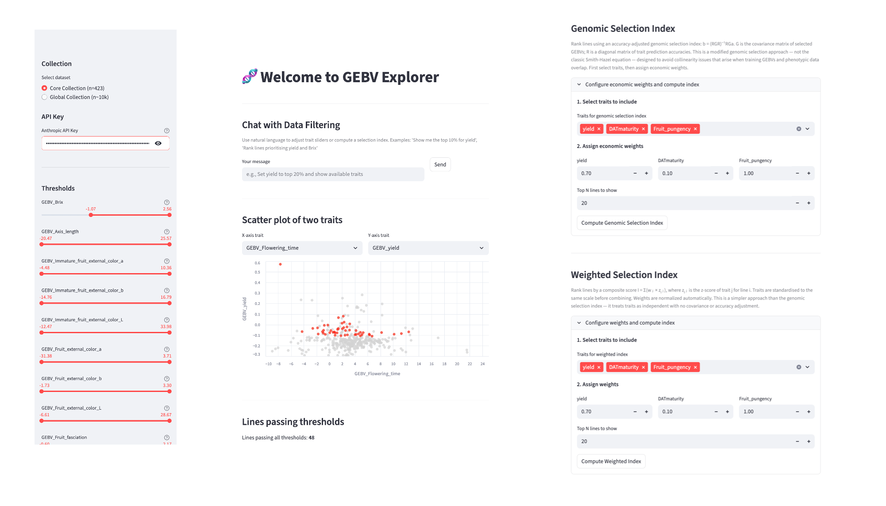

# GEBV Explorer (v2)

Interactive visualization of genomic estimated breeding values (GEBVs) for Capsicum (pepper) crops. This repository contains two apps:

- **Core Collection App** — 423 accessions (Capsicum core collection)
- **Global Collection App** — 10,026 accessions (global Capsicum collection)



## Features

- **Interactive Sliders**: Filter lines by any GEBV trait or combination using sidebar sliders
- **Chat with Data Filtering**: Use natural language to adjust filters (e.g., "Show me the top 10% for yield")
- **Scatter Plot Visualization**: Explore any two-trait scatterplot with filtered points highlighted in red
- **Trait Correlation Heatmap**: View correlations between all GEBV traits
- **CSV Export**: Download filtered lines as a CSV file

---

## Running with Docker (Recommended)

Docker bundles everything — no Python setup, no virtual environments, no dependency conflicts.

### Requirements
- [Docker Desktop](https://www.docker.com/products/docker-desktop/) (Mac/Windows) or Docker Engine (Linux)
- An Anthropic API key from https://console.anthropic.com/

### Setup

**1. Clone the repository**
```bash
git clone https://github.com/ahmccormick/GEBV_Explorer_V2.git
cd GEBV_Explorer_V2
```

**2. Start the apps**
```bash
docker compose up
```

Both apps will be available at:
- Core Collection: http://localhost:8501
- Global Collection: http://localhost:8502

To stop: press `Ctrl+C`, then `docker compose down`.

**Providing your API key:**

You can enter your Anthropic API key directly in the app sidebar — no `.env` file needed. Alternatively, create a `.env` file to pre-fill it automatically:
```bash
echo "ANTHROPIC_API_KEY=your-api-key-here" > .env
```

> **Note:** The first `docker compose up` will take a few minutes to build the image and download dependencies. Subsequent starts are fast.

---

## Running Manually (Without Docker)

### 1. Clone the repository
```bash
git clone https://github.com/ahmccormick/GEBV_Explorer_V2.git
cd GEBV_Explorer_V2
```

### 2. Create and activate a virtual environment (Python 3.12)
```bash
python3 -m venv venv
source venv/bin/activate
```

### 3. Install dependencies
```bash
pip install -r requirements.txt
```

### 4. Set up API key (required for Chat with Data Filtering)
Create a `.env` file in the project root:
```bash
echo "ANTHROPIC_API_KEY=your-api-key-here" > .env
```
Replace `your-api-key-here` with your Anthropic API key from https://console.anthropic.com/

### Running the Core Collection App (n=423)

```bash
# Terminal 1: API server (port 5001)
python gebv_api_server.py

# Terminal 2: Streamlit app
streamlit run GEBV_app.py
```

Opens at http://localhost:8501

### Running the Global Collection App (n=10,026)

```bash
# Terminal 1: API server (port 5002)
python global/global_api_server.py

# Terminal 2: Streamlit app
streamlit run global/global_app.py
```

Opens at http://localhost:8501 (or 8502 if the core app is already running)

### Running Both Apps Simultaneously

```bash
python gebv_api_server.py &            # port 5001
streamlit run GEBV_app.py &            # port 8501
python global/global_api_server.py &   # port 5002
streamlit run global/global_app.py     # port 8502
```

---

## Usage

### Manual Filtering
- Adjust sliders on the left sidebar to filter lines by any GEBV trait
- The filtered table updates in real time
- Red points in the scatter plot highlight lines meeting all threshold criteria

### Chat with Data Filtering
Use natural language commands to adjust filters:
- "Show me the top 10% for yield"
- "Filter for high Brix and low pungency" *(core app)*
- "Show plants with the highest fruit number" *(global app)*
- "Reset all filters"

### Scatter Plot
- Select any two traits for X and Y axes
- Gray points show all lines; red points show filtered lines
- Interactive zoom and pan

### Export
- Click "Download filtered CSV" to export the current filtered dataset

---

## Data

### Core Collection
- **Quality traits** (23): `data/GEBVs_ag_73traitmean_n423.csv`
- **Agronomic traits** (73): `data/GEBVs_quality_23trait_n423.csv` (averaged over three experimental timepoints)
- **Trait metadata**: `data/Trait_Metadata_with_Synonyms.xlsx`

### Global Collection
Both CSVs in `global/data/` contain the same 13 GEBV traits measured under different conditions. After merging, each trait appears with a suffix indicating its source:
- `_x` suffix: value from the phenotyping/quality CSV
- `_y` suffix: value from the agronomic averages CSV (averaged over three experimental timepoints)

This results in 96 total trait columns. The chat assistant defaults to the `_y` (averaged) variant when a trait is requested without a suffix.

- `global/data/GEBVs_quality_23trait_n10026.csv`
- `global/data/GEBVs_ag_73traitmean_n10024.csv`

---

## Architecture

```
# Core collection
GEBV_app.py              # Streamlit web interface
gebv_api_server.py       # Flask API for slider state (port 5001)
gebv_mcp_server.py       # MCP server for tool-based interactions
mcp_chat.py              # Chat integration module
data/                    # Core collection data files

# Global collection
global/
├── global_app.py            # Streamlit web interface
├── global_api_server.py     # Flask API for slider state (port 5002)
├── global_mcp_server.py     # MCP server for tool-based interactions
├── global_mcp_chat.py       # Chat integration module
└── data/                    # Global collection data files

# Docker
Dockerfile               # Single image for both apps
docker-compose.yml       # Runs core (→ 8501) and global (→ 8502) as separate services
start_core.sh            # Startup script for core container
start_global.sh          # Startup script for global container
```
